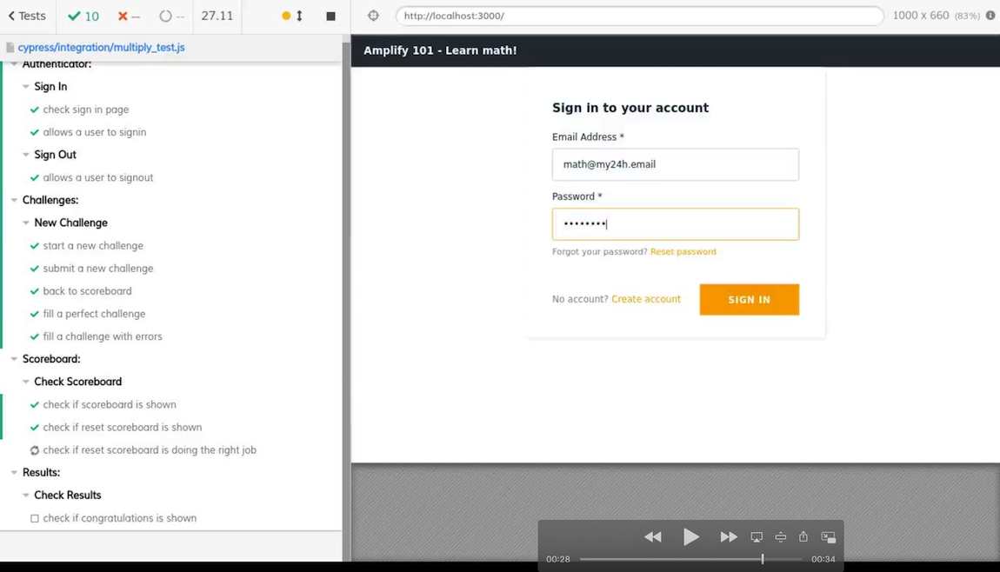

# Amplify 101

This project is my first approach to AWS Amplify framework.
It's a test web application to teach multiplication tables to my son.

Frontend application is developed in React.
Backend is implemented using Amplify framework, Lambda (Python) functions and DynamoDB.  

[Test your math skills!](https://master.d1klskzlqjw0rf.amplifyapp.com/)  

## Prerequisites

- Node.js v10.x or later
- npm v5.x or later
- git v2.14.1 or later
- AWS Account
- Amplify CLI installed and configured

## AWS Amplify Tutorial

I used this tutorial to learn about AWS Amplify:

https://docs.amplify.aws/start/getting-started/installation/q/integration/react

## CI Docker image

Amplify can't find Python3.8 on build phase of CI/CD using default build image. To fix this bug, a custom Docker image is used in build phase. [Opened issue](https://github.com/aws-amplify/amplify-console/issues/595)

### Typical Docker tasks

```
# Pull from Docker Hub
docker pull vnardone/amplify-python38:latest
# Run image
docker run -it vnardone/amplify-python38 bash

# Use as base image
FROM vnardone/amplify-python38:latest
```
## Cypress End to End testing

[Cypress](https://www.cypress.io/) is used in CI pipeline to perform end to end testing of Amplify application.
Configuration file [cypress.json](./cypress.json) add shadow DOM support. 

Tests are defined in [multiply_test.js](./cypress/integration/multiply_test.js).
CI test phase is defined in [amplify.yml](./amplify.yml) configuration file.


<a href="./cypress/videos/multiply_test.js.mp4" title="CI Test phase video"></a>
